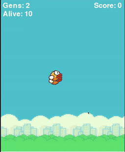

# FlappyBirdAI

Using NEAT Python to learn to play Flappy Bird. This code uses search and optimise technique called genetic algorithm which creates a particular number of random configurations, the best configuration of them is used to create the next generation of neural networks, as we repeat the process, with time, we observe that the performance gets better. 

